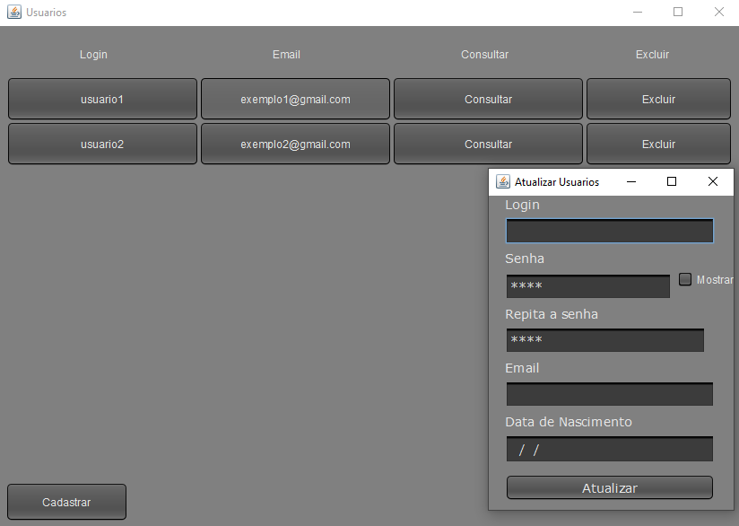

# Cadastro
CRUD simples com JavaSwing padrão MVC utilizando o Firebase.  
VideoTutorial:`https://youtu.be/lXGWcc5XRP4`  
# Executar  
- git clone `https://github.com/JoseGabrielNF/cadastro`    
- Configurar chave firebase e colocar na pasta raiz.

 
