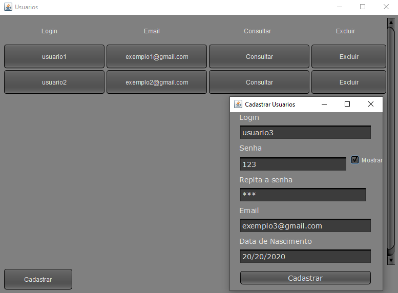

# Cadastro
CRUD simples com JavaSwing padrão MVC utilizando o Firebase.  

Todas as telas de cadastro abertas são atualizadas simultaneamente  
em todos os computadores conectados no mesmo servidor.  

VideoTutorial:https://youtu.be/lXGWcc5XRP4  

# Executar  
- git clone `https://github.com/JoseGabrielNF/cadastro`    
- configurar chave firebase e colocar na pasta raiz.

 
